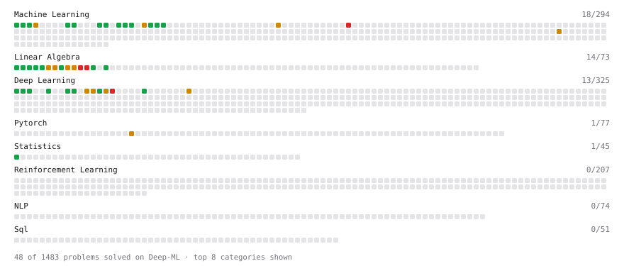

# Deep-ML

My machine learning practice from [Deep-ML](https://www.deep-ml.com). Every solution here was written by hand.

**37** solved · 35 problems · 2 labs · 0 math

[**Browse the interactive portfolio**](https://riemann203.github.io/deep-ml/) to replay this filling in over time.

## Problems

| | Difficulty | Solved | |
| --- | --- | --- | --- |
| [Batch Iterator for Dataset](https://www.deep-ml.com/problems/30) | easy | 2026-09-17 | [solution](problems/0030-batch-iterator-for-dataset) |
| [Calculate 2x2 Matrix Inverse](https://www.deep-ml.com/problems/8) | easy | 2026-08-16 | [solution](problems/0008-calculate-2x2-matrix-inverse) |
| [Calculate Covariance Matrix](https://www.deep-ml.com/problems/10) | easy | 2026-08-16 | [solution](problems/0010-calculate-covariance-matrix) |
| [Calculate Mean by Row or Column](https://www.deep-ml.com/problems/4) | easy | 2026-08-16 | [solution](problems/0004-calculate-mean-by-row-or-column) |
| [Feature Scaling Implementation](https://www.deep-ml.com/problems/16) | easy | 2026-09-17 | [solution](problems/0016-feature-scaling-implementation) |
| [Implement the Hard Sigmoid Activation Function](https://www.deep-ml.com/problems/96) | easy | 2026-09-17 | [solution](problems/0096-implement-the-hard-sigmoid-activation-function) |
| [Implementation of Log Softmax Function](https://www.deep-ml.com/problems/39) | easy | 2026-09-17 | [solution](problems/0039-implementation-of-log-softmax-function) |
| [Linear Regression Using Gradient Descent](https://www.deep-ml.com/problems/15) | easy | 2026-08-20 | [solution](problems/0015-linear-regression-using-gradient-descent) |
| [Linear Regression Using Normal Equation](https://www.deep-ml.com/problems/14) | easy | 2026-08-20 | [solution](problems/0014-linear-regression-using-normal-equation) |
| [Matrix-Vector Dot Product](https://www.deep-ml.com/problems/1) | easy | 2026-08-12 | [solution](problems/0001-matrix-vector-dot-product) |
| [One-Hot Encoding of Nominal Values](https://www.deep-ml.com/problems/34) | easy | 2026-09-17 | [solution](problems/0034-one-hot-encoding-of-nominal-values) |
| [Random Shuffle of Dataset](https://www.deep-ml.com/problems/29) | easy | 2026-09-17 | [solution](problems/0029-random-shuffle-of-dataset) |
| [Reshape Matrix](https://www.deep-ml.com/problems/3) | easy | 2026-08-16 | [solution](problems/0003-reshape-matrix) |
| [Scalar Multiplication of a Matrix](https://www.deep-ml.com/problems/5) | easy | 2026-08-16 | [solution](problems/0005-scalar-multiplication-of-a-matrix) |
| [Sigmoid Activation Function Understanding](https://www.deep-ml.com/problems/22) | easy | 2026-09-17 | [solution](problems/0022-sigmoid-activation-function-understanding) |
| [Single Neuron](https://www.deep-ml.com/problems/24) | easy | 2026-09-17 | [solution](problems/0024-single-neuron) |
| [Softmax Activation Function Implementation ](https://www.deep-ml.com/problems/23) | easy | 2026-09-17 | [solution](problems/0023-softmax-activation-function-implementation) |
| [Transformation Matrix from Basis B to C](https://www.deep-ml.com/problems/27) | easy | 2026-09-17 | [solution](problems/0027-transformation-matrix-from-basis-b-to-c) |
| [Transpose of a Matrix](https://www.deep-ml.com/problems/2) | easy | 2026-08-16 | [solution](problems/0002-transpose-of-a-matrix) |
| [Calculate Eigenvalues of a Matrix](https://www.deep-ml.com/problems/6) | medium | 2026-08-16 | [solution](problems/0006-calculate-eigenvalues-of-a-matrix) |
| [Entropy & Cross-Entropy](https://www.deep-ml.com/problems/205) | medium | 2026-09-15 | [solution](problems/0205-entropy-cross-entropy) |
| [Find the Best Gini-Based Split for a Binary Decision Tree](https://www.deep-ml.com/problems/138) | medium | 2026-09-05 | [solution](problems/0138-find-the-best-gini-based-split-for-a-binary-decision-tree) |
| [Implement an LSTM Cell from Scratch](https://www.deep-ml.com/problems/907) | medium | 2026-09-15 | [solution](problems/0907-implement-an-lstm-cell-from-scratch) |
| [Implement Lasso Regression using ISTA](https://www.deep-ml.com/problems/50) | medium | 2026-09-06 | [solution](problems/0050-implement-lasso-regression-using-ista) |
| [Implement Long Short-Term Memory (LSTM) Network](https://www.deep-ml.com/problems/59) | medium | 2026-09-15 | [solution](problems/0059-implement-long-short-term-memory-lstm-network) |
| [Implementing a Simple RNN](https://www.deep-ml.com/problems/54) | medium | 2026-09-14 | [solution](problems/0054-implementing-a-simple-rnn) |
| [K-Means Clustering](https://www.deep-ml.com/problems/17) | medium | 2026-09-16 | [solution](problems/0017-k-means-clustering) |
| [Learning Curve Generator for Bias-Variance Diagnosis](https://www.deep-ml.com/problems/800) | medium | 2026-09-07 | [solution](problems/0800-learning-curve-generator-for-bias-variance-diagnosis) |
| [Matrix times Matrix ](https://www.deep-ml.com/problems/9) | medium | 2026-08-16 | [solution](problems/0009-matrix-times-matrix) |
| [Matrix Transformation ](https://www.deep-ml.com/problems/7) | medium | 2026-08-16 | [solution](problems/0007-matrix-transformation) |
| [Solve Linear Equations using Jacobi Method](https://www.deep-ml.com/problems/11) | medium | 2026-08-16 | [solution](problems/0011-solve-linear-equations-using-jacobi-method) |
| [Determinant of a 4x4 Matrix using Laplace's Expansion (hard)](https://www.deep-ml.com/problems/13) | hard | 2026-08-20 | [solution](problems/0013-determinant-of-a-4x4-matrix-using-laplace-s-expansion-hard) |
| [Gaussian Process for Regression](https://www.deep-ml.com/problems/186) | hard | 2026-09-17 | [solution](problems/0186-gaussian-process-for-regression) |
| [Implement a Simple RNN with Backpropagation Through Time (BPTT)](https://www.deep-ml.com/problems/62) | hard | 2026-09-14 | [solution](problems/0062-implement-a-simple-rnn-with-backpropagation-through-time-bptt) |
| [Singular Value Decomposition (SVD) of 2x2 Matrix](https://www.deep-ml.com/problems/12) | hard | 2026-08-19 | [solution](problems/0012-singular-value-decomposition-svd-of-2x2-matrix) |

## Labs

| | Difficulty | Solved | |
| --- | --- | --- | --- |
| [Train a Binary Classifier](https://www.deep-ml.com/labs/23) | easy | 2026-10-01 | [solution](labs/0023-train-a-binary-classifier) |
| [Train a Linear Regression Model](https://www.deep-ml.com/labs/18) | easy | 2026-10-01 | [solution](labs/0018-train-a-linear-regression-model) |

---

_This file is regenerated by Deep-ML on every push._
